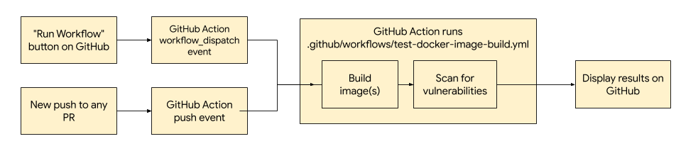

# ts-bridge CI with GitHub Actions

This folder contains GitHub Action workflows which automate releases, security scans, tests and dev builds for ts-bridge.

## Code Scanning with CodeQL

**File:** `codeql-analysis.yml`

**Triggers**: `push`, `pull_request`, `schedule` (Weekly at 7:40am Tuesdays)

[CodeQL](https://docs.github.com/en/free-pro-team@latest/github/finding-security-vulnerabilities-and-errors-in-your-code/about-code-scanning#about-codeql) scans for vulnerabilities in the source code (in Python and Go for TS-Bridge), and creates alerts when any is found. Alerts can be viewed, fixed and dismissed in the "Security" tab on GitHub.

## Run Go Tests

**File:** `go-tests.yml`

**Triggers**: `push`, `pull_request`, `release`

Runs Go unit tests on latest (1.15.x), major release before latest (1.14.x), prerelease version (1.16beta1), and annotates failed tests in workflow summary.

## Tag and Release Go Binaries

**File:** `go-releaser.yml`

**Triggers**: `push` to `version/ts-bridge-version.go` only

Automatically create a release tag (with an empty body) for the commit, then run [GoReleaser](https://goreleaser.com/) to create a draft release with the same tag. The draft release will have its body pre-filled with a changelog, with its assets being go binaries and a source archive([Details](https://github.com/google/ts-bridge/pull/75)).

## Run Python Unit Tests

**File:** `run-python-tests.yml`

**Triggers**: `push` to `ci/parse_trivy_results.py` only

Runs unit tests for the Trivy results parser, which is used for automated Trivy scans.

## Dev Build for Docker images

**File:** `test-docker-image-build.yml`

**Triggers**: `pull_request`, `workflow_dispatch` (Manual triggers enabled)

To ensure that PRs do not negatively affect docker builds and trivy scans on
existing public images, this workflow performs similar
tasks as the prod builds (please refer to [CI with Cloud Build](https://github.com/google/ts-bridge/blob/master/ci/README.md)), without creating
issues or publishing images to GCR.

This workflow will be triggered by the following conditions:

* On every PR to the master branch

* (Manual) When the "Run Workflow" button is clicked on GitHub Actions tab

The complete flowchart for the dev build is shown below:

Specifically, the GitHub workflow will complete the following:

1. Build a ts-bridge image using the [Dockerfile](https://github.com/google/ts-bridge/blob/master/Dockerfile).

1. Perform security scanning of images using [Trivy](https://github.com/aquasecurity/trivy#docker). This can find image vulnerabilities of low, medium, high or critical severities. If any vulnerabilities were found (of any level of severity), this step will fail.

If any of the above steps fail, the result will show under the "checks"
section of the corresponding GitHub PR.
