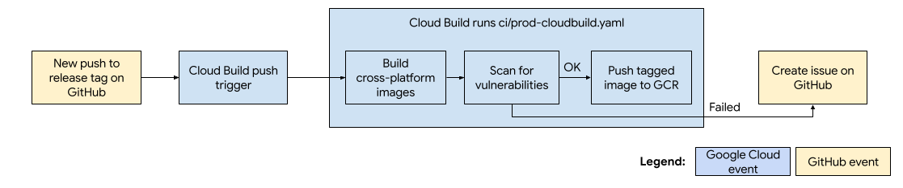

# ts-bridge CI with Cloud Build

This CI automates the building and releasing of ts-bridge images for public
use on Google Container Registry. ts-bridge images are built using
[Google Cloud Build](https://cloud.google.com/cloud-build/docs/automating-builds/run-builds-on-github)
through [cloudbuild.yaml](https://github.com/google/ts-bridge/blob/master/ci/cloudbuild.yaml).
To view the documentation for dev builds, please refer to [CI with GitHub Actions](https://github.com/google/ts-bridge/blob/master/.github/workflows/README.md).

Images are published externally and anyone can pull them from:

`gcr.io/cre-tools/ts-bridge:{tag}`

## Cloud Build

The complete flowchart for CI is shown below:

### Triggers
Cloud Build triggers are configured purely on Google Cloud Platform (GCP, not on
GitHub), which this repo is connected to. The CloudBuild trigger will occur on
every push to a released tag.

### cloudbuild.yaml
When a trigger event occurs, the
trigger on Cloud Build has been configured to run `ci/cloudbuild.yaml` in this
repository. It will complete the following:
1. Build a ts-bridge image using the [Dockerfile](https://github.com/google/ts-bridge/blob/master/Dockerfile).
1. Perform security scanning of images using [Trivy](https://github.com/aquasecurity/trivy#docker). This can find image vulnerabilities of low, medium, high or critical severities.
    * If any vulnerabilities were found (of any level of severity), a Github issue will be created. For simplicity, at most one issue per release will be created, containing all the vulnerabilities found in that release.
    * If vulnerabilities with CRITICAL/HIGH severity were found, the build will fail and the images will not be pushed to GCR.
1. If the previous step succeeded, push the image with the following tags to GCR.
    * latest
    * full, major and minor version
    * commit ID (prefixed with `git-`)
    * build ID (prefixed with `build-`)
    * timestamp
1. The new image will be available for pulling from `gcr.io/cre-tools/ts-bridge:{tag}`
